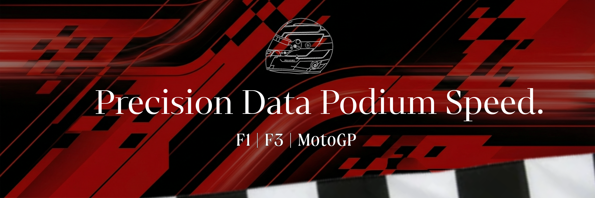

# MotoGP PRM - F1 & MotoGP Discord Bot

<p align="center">
  
</p>

<p align="center">
  <a href="https://nodejs.org/"></a>
  <a href="https://discord.js.org/"></a>
  <a href="./LICENSE"></a>
</p>

**MotoGP PRM** is a comprehensive Discord bot designed for motorsport enthusiasts. It brings real-time data, detailed statistics, and live updates for **Formula 1**, **MotoGP**, and **Formula 3** directly to your Discord server.

## Features

*   **Live Race Data:** Instant access to upcoming race schedules, countdowns, and session times converted to your local timezone.
*   **Comprehensive Stats:** Detailed profiles for Drivers, Teams, and Circuits, including technical specifications and historical records.
*   **Live Standings & Results:** Up-to-date championship standings and race results for multiple series.
*   **Community Engagement:** Interactive trivia, polls, and fun commands like random quotes and GIFs.
*   **Notifications:** Automated alerts 1 hour before every race session so you never miss the action.

---

## �️ Command Reference

Here is the complete list of available commands. All commands start with `/`.

### 🏁 Race Tracking
| Command | Options | Description |
| :--- | :--- | :--- |
| `/next` | `series` (F1, MotoGP, F3) | Get a detailed schedule for the upcoming Grand Prix, including all session times. |
| `/countdown` | `series` (F1, MotoGP, F3) | Displays a live countdown timer to the start of the race week and the main race. |
| `/calendar` | — | View the full season calendar with dates and statuses. |
| `/notify` | — | Manage your personal notification settings for race alerts. |

### 📊 Statistics & Data
| Command | Options | Description |
| :--- | :--- | :--- |
| `/results` | `series`, `year`, `round` | Fetch race results for a specific round. |
| `/standings` | `series`, `type` (Driver/Constructor), `year` | View current or historical championship standings. |
| `/driver` | `name` | Search for a driver's profile, career stats, and helmet design. |
| `/team` | `name` | **NEW!** Detailed team profile including tech specs, driver lineup, and recent form. |
| `/circuit` | `name` | Get circuit layout, statistics, and lap record information. |

### 🎮 Fun & Utility
| Command | Options | Description |
| :--- | :--- | :--- |
| `/trivia` | — | Challenge yourself effectively with a random F1 trivia question. |
| `/vote` | — | Create a poll for your server members. |
| `/quote` | — | Get an iconic random quote from the world of F1. |
| `/gif` | `query` | Search for motorsport-related GIFs to share. |
| `/news` | — | (Experimental) Fetch the latest F1 news headlines. |
| `/help` | — | Show a list of all commands and bot information. |
| `/info` | — | View bot status, uptime, and server count. |
| `/support` | — | Get links to the support server or developer contact. |

---

## ⚙️ Installation & Setup

Follow these steps to host your own instance of the bot.

### Prerequisites

*   [Node.js](https://nodejs.org/) (Version 16.9.0 or higher)
*   [Git](https://git-scm.com/)
*   A textual code editor (e.g., VS Code)
*   A Discord Bot Token from the [Discord Developer Portal](https://discord.com/developers/applications).

### 1. Clone the Repository
Open your terminal and run:
```bash
git clone https://github.com/Start-05/discord-bot-motogpprm.git
cd discord-bot-motogpprm
```

### 2. Install Dependencies
Install the required Node.js packages:
```bash
npm install
```

### 3. Configure Variables
Create a file named `.env` in the root directory and populate it with your credentials:
```env
TOKEN=your_discord_bot_token_here
CLIENT_ID=your_application_id_here
GUILD_ID=optional_test_server_id
```
> **Note:** `GUILD_ID` is optional but recommended for instantly updating commands in a specific server during development.

### 4. Deploy Commands
Register the slash commands with Discord:
```bash
node deploy-commands.js
```
*You should see a success message indicating the number of commands loaded.*

### 5. Start the Bot
Run the bot:
```bash
npm start
```

---

## 🤝 Contributing

Contributions are welcome! If you'd like to improve the bot:

1.  **Fork** the repository.
2.  Create a **Feature Branch** (`git checkout -b feature/NewCoolAction`).
3.  **Commit** your changes (`git commit -m 'Added NewCoolAction'`).
4.  **Push** to the branch (`git push origin feature/NewCoolAction`).
5.  Open a **Pull Request**.

---

## 📄 License

This project is licensed under the [MIT License](./LICENSE).

---

<p align="center">
  Made with ❤️ by <b>Vishwa Pramuditha</b>
</p>
